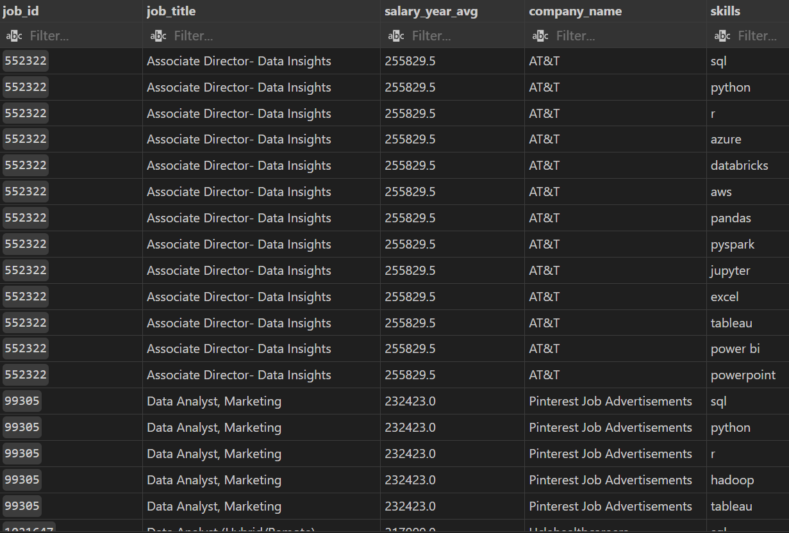

# Project Background
Realizing that the data analyst job market has been increasingly growing all over the world, the author of these findings is urged to do a research as a reference for anyone willing to jump into this market.

### Insights are provided based on the answers of these following questions: 
1. What are the top-paying data analyst jobs?
2. What skills are required for these top-paying jobs?
3. What skills are associated with higher salaries?
4. What are the most optimal skills to learn?

The SQL queries can be found here: [Project_sql folder](/sql_project/)
# Tool I Used
For my deep dive into the data analyst market, I employed several key tools:

- SQL: The main language to query database and discover insight.
- Git & GitHub: Essential for version control and sharing my findings.
- PostgreSQL: The chosen database management system.
# Data Structure
Database structure as seen below consists of four tables: company, skills_job, skills, job_postings.

# Executive Summary
High Salary Potential: Top-paying data analyst roles offer salaries from 
184,000 to 650,000, with employers across various industries, including Meta and SmartAsset.

In-Demand Skills: Key skills for top roles include SQL, Python, and Tableau, with emerging demand for big data (PySpark, Couchbase) and machine learning (Jupyter).

Crossover Skills: Proficiency in software development tools (GitLab, Airflow) indicates a fusion of data analysis and engineering, while cloud computing expertise is increasingly critical.

Accessible Programming Languages: Python and R are popular with low barriers to entry, yielding average salaries of 
101
,
397
a
n
d
100,499, respectively.

Important Tools: Knowledge of cloud tools (AWS, Snowflake, Azure) and business intelligence tools (Tableau, Looker) is essential, though these do not command the highest salaries compared to top tier analyst positions.
### 1. Top Paying Data Analyst Jobs

- Wide Salary Range: Top 10 paying data analyst roles range from $184,000 to $650,000, showing huge salary potential. 

- Diverse Employers: Several companies across different industries are willing to pay big in this field, such as Meta, SmartAsset...

- Job Title Variety: There are various job positions, indicating a lot of specialization with Data Analytics.

### 2. Top Paying Job Skills (The Skills needed in those top paying jobs)

.png)

Based on the result, the most demanded skills for top 10 highest paying data analyst job are SQL, Python, Tableau respectively. Other skills such as R, Snowflake Pandas and Excel show varying degrees of demand.

### 3. Skills Based on Salary
These are top 10 skills based on salary.
| Skills       | Average Salary ($)| 
|--------------|---------------|
|pyspark       |208,172         |
|bitbucket     |189,155         |
|couchbase     |160,515         |
|watson        |160,515         |
|datarobot     |155,486         |
|gitlab        |154,500         |
|swift         |153,750         |
|jupiter       |152,777         |
|pandas        |151,821         |
|elasticsearch |145,000         |
- High demand for Big data and ML Skills: Data Analysts majoring in big data technology (PySpark,Couchbase), machine learning tools (Jupiter) and Python libraries 
are more valued in an industry focusing on data processing and predictive modeling capabilities.

- Software development and Deployment proficiency: Knowledge in development and deployment tools (Gitlab, Airflow) indicates a crossover between engineering and data analysis.

- Cloud computing expertise: Cloud-based analytics environments are expected to be of utmost importance, suggesting cloud proficiency is a must.

### 4. Most Optimal Skills to Learn
These are top 10 skills that most both high paying and demanded.

| Skill ID       | Skills| Demand Count| Average Salary ($) |
|--------------|---------------|-------|----|
|8       |go       |27|115,320|
|234    |confluence | 11 | 114,210|
|97    |hadoop         |22| 113,193
|80        |snowflake         |37|112948|
|74     |azure         |34|111,225|
|77        |bigquery        |13| 109,654|
|76         |aws         |32|108,317|
|4       |java       |17|106,906|
|194        |ssis         |12|106,683|
|233 |jira        |20|104,918|

- High-demand programming languages: Although Python and R stand out for their high demand, with demand counts of 236 and 148 respectively, the salary associated are not high enough to be in the top 10, with $101,397 for Python and $100,499 for R, showing that these two languages are easy enough for more and more people to learn.

- Cloud Tools and Technologies: As with the finding from point 3, cloud tools such as AWS, snowflake, azure are expected to be of utmost importance in the era of big data technologies.

- Business Intelligence and Visualization Tools: Similar to the case of programming language, Tableau and Looker, with demand counts of 239 and 49 respectively, can not help people yield income as high as the top ten (with $99,288 for Tableau and $103,795 for Looker).

# Conlusion
This project not only helps me hone my SQL skills but also provides a comprehensive understanding of the current data analytics job market. This market has significant potential growth; however, the demands of employers are becoming increasingly challenging. They prioritize candidates with knowledge of cloud-based technology and big data, indicating an upcoming global shift.